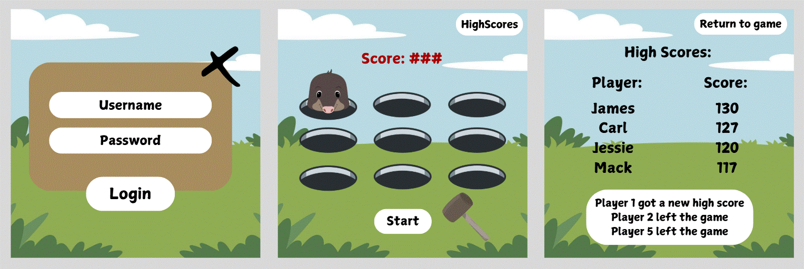
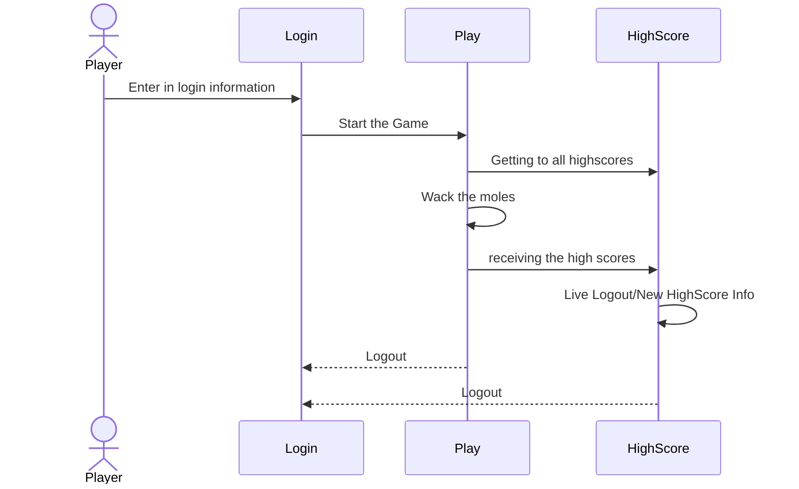

# Wack-a-Mole

[My Notes](notes.md)

The application that I want to create is a Wack-a-Mole. It was one of the games that I loved to play as a little girl when we went to the arcade. I am going to have it so then they have a sign-in page so then they can make an account and with that, they will be able to start the game. It will start pretty easy and slow and you will be able to get points for the moles that you are successfully able to kit in that timeframe. As the game continues the moles are going to get faster and faster and at the end of the game, you will be able to see your score. You will also be able to go to a different page and see the high scores of the other players that have played the game. 

> [!NOTE]
>  This is a template for your startup application. You must modify this `README.md` file for each phase of your development. You only need to fill in the section for each deliverable when that deliverable is submitted in Canvas. Without completing the section for a deliverable, the TA will not know what to look for when grading your submission. Feel free to add additional information to each deliverable description, but make sure you at least have the list of rubric items and a description of what you did for each item.

> [!NOTE]
>  If you are not familiar with Markdown then you should review the [documentation](https://docs.github.com/en/get-started/writing-on-github/getting-started-with-writing-and-formatting-on-github/basic-writing-and-formatting-syntax) before continuing.

## 🚀 Specification Deliverable

> [!NOTE]
>  Fill in this sections as the submission artifact for this deliverable. You can refer to this [example](https://github.com/webprogramming260/startup-example/blob/main/README.md) for inspiration.

For this deliverable I did the following. I checked the box `[x]` and added a description for things I completed.

- [x] Proper use of Markdown
- [x] A concise and compelling elevator pitch
- [x] Description of key features
- [x] Description of how you will use each technology
- [x] One or more rough sketches of your application. Images must be embedded in this file using Markdown image references.

### Elevator pitch

When you were younger did you ever go to the arcade and have the best time of your life playing the games there? It was like entering into a new world with limitless fun at the tip of your finger! This Wack-a-mole application allows you to bring home one of these classic arcade games to play on your computer right in your living room! Each player will be able to play this intense version of this classic childhood game and be able to see the high scores of other users to make this game a little more competitive! Don't miss out and go Wack-a-Mole!

### Design

Backend design for the Game: 

### Key features
- Ability to create a login
- Play a fun game of Wack-a-Mole
- Ability to see the Highscores of other players
- Ability to see your score
- Ability to see when people end their games
- Ability to see when someone gets a new highscore

### Technologies

I am going to use the required technologies in the following ways.

- **HTML** - Uses correct HTML structure for application. Three HTML pages. One for login, one for the game and one for the highscores
- **CSS** - animating the game and style of the login and the highscores
- **REACT** - Provides login, interactive part of the game and the highscores
- **Web Service** - Uses Savescores to save the highscores of the player and apilayer mailboxlayer ([https://eva.pingutil.com/](https://mailboxlayer.com/)) to validate email addresses of the players when they are making a login
- **Authentication** - Allows player to create an account and login.
- **Database data**: A rendering of application data that is stored in the database. For Wack-a-Mole, this is the high scores of all players.
- **WebSocket data** -  A rendering of data that is received from your server. For Wack-a-Mole, the newest high score will be sent to players

### Example of representing all technologies

## 🚀 AWS deliverable

For this deliverable I did the following. I checked the box `[x]` and added a description for things I completed.

- [x] **Server deployed and accessible with custom domain name** - [http://wackamole.click](http://wackamole.click).

## 🚀 HTML deliverable

For this deliverable I did the following. I checked the box `[x]` and added a description for things I completed.

- [x] **HTML pages** - I created 4 pages for my whack-a-mole, index, scores, about, play
- [x] **Proper HTML element usage** - I used them all on each pages and they can be seen in the code
- [x] **Links** - you are able to click at the top to each page and move between the pages
- [x] **Text** - in the about page and on each page letting you know what is going on 
- [x] **3rd party API placeholder** - to make sure that they email is valid in the index page paired with the username
- [x] **Images** - at the top there is a mole wiht a corwn on each pages for the images
- [x] **Login placeholder** - on the index page along iwth passwork, able to login and create and account
- [x] **DB data placeholder** - in the high scores to save highscores and your scores
- [x] **WebSocket placeholder** - on the play page to get updates on when people get highscores

## 🚀 CSS deliverable

For this deliverable I did the following. I checked the box `[x]` and added a description for things I completed.

- [x] **Header, footer, and main content body** - This has been done in my main.css and all my pages link back to it for correct foramtting.
- [x] **Navigation elements** - This has also been done in my main.css and the other pages also link to this to have the correct navbar and the same formatting
- [x] **Responsive to window resizing** - Yes, all my pages are responsive to resizing in their proper .css
- [x] **Application elements** - They are done with the login and password in the index along with creating user updates and scores in the play section and highscores. Along with style for the play section with the 3x3 grid and start
- [x] **Application text content** - found throughout the pages and mainly on the about page 
- [x] **Application images** - found in the navigation bar along with on the highscore page

## 🚀 React part 1: Routing deliverable

For this deliverable I did the following. I checked the box `[x]` and added a description for things I completed.

- [x] **Bundled using Vite** -  I did this part as we went through it during class
- [x] **Components** - I added all the different components for my pages login, play, about and highscores. Followed the steps in class and followed teh video
- [x] **Router** - There is routing between the different pages and everything from class instruction and video
## 🚀 React part 2: Reactivity

For this deliverable I did the following. I checked the box `[x]` and added a description for things I completed.

- [x] **All functionality implemented or mocked out** - login adn create account works, along iwth you are able to play a whack a mole game, the players are mocked out on the top right and the time and the scores change. you are then also able to see your updated scores in the score secion along with the about page ahs the inforamtion that you need
- [x] **Hooks** - everything is on the pages and set up for it

## 🚀 Service deliverable

For this deliverable I did the following. I checked the box `[x]` and added a description for things I completed.

- [x] **Node.js/Express HTTP service** - did this as i went throug the instructions
- [x] **Static middleware for frontend** -  my Frontend is served up using Express static middleware
- [x] **Calls to third party endpoints** - did this on the about page with the images of nature
- [x] **Backend service endpoints** - completed the backend for my pages
- [x] **Frontend calls service endpoints** - throughout the different pages it called the endpoints, all logout and login and registartion all works

## 🚀 DB/Login deliverable

For this deliverable I did the following. I checked the box `[x]` and added a description for things I completed.

- [ ] **User registration** - I did not complete this part of the deliverable.
- [ ] **User login and logout** - I did not complete this part of the deliverable.
- [ ] **Stores data in MongoDB** - I did not complete this part of the deliverable.
- [ ] **Stores credentials in MongoDB** - I did not complete this part of the deliverable.
- [ ] **Restricts functionality based on authentication** - I did not complete this part of the deliverable.

## 🚀 WebSocket deliverable

For this deliverable I did the following. I checked the box `[x]` and added a description for things I completed.

- [ ] **Backend listens for WebSocket connection** - I did not complete this part of the deliverable.
- [ ] **Frontend makes WebSocket connection** - I did not complete this part of the deliverable.
- [ ] **Data sent over WebSocket connection** - I did not complete this part of the deliverable.
- [ ] **WebSocket data displayed** - I did not complete this part of the deliverable.
- [ ] **Application is fully functional** - I did not complete this part of the deliverable.
